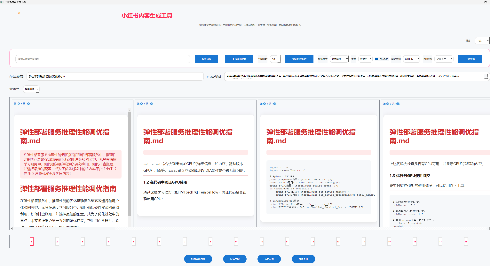

# Xiaohongshu Content Generator 🚀✨  
[](LICENSE)
[](https://www.python.org/)
[](https://github.com/xhs-tools/xhs-tools/issues)
[](https://github.com/xhs-tools/xhs-tools/stargazers)
[](https://github.com/xhs-tools/xhs-tools/network/members)

<div align="center">
  
  <h1>小红书内容生成工具</h1>
  <p>让内容创作更高效、更美观、更智能！</p>
  <a href="#%E7%89%B9%E6%80%A7">特性</a> •
  <a href="#%E5%AE%89%E8%A3%85%E4%B8%8E%E5%BF%AB%E9%80%9F%E5%BC%80%E5%A7%8B">安装与快速开始</a> •
  <a href="#%E4%BD%BF%E7%94%A8%E8%AF%B4%E6%98%8E">使用说明</a> •
  <a href="#%E7%9B%AE%E5%BD%95%E7%BB%93%E6%9E%84">目录结构</a> •
  <a href="#%E4%B8%BB%E8%A6%81%E6%A8%A1%E5%9D%97">主要模块</a> •
  <a href="#%E4%BD%BF%E7%94%A8%E6%B5%81%E7%A8%8B">使用流程</a> •
  <a href="#%E6%9C%AA%E6%9D%A5%E5%B1%95%E6%9C%9F">未来展望</a> •
  <a href="#%E8%B4%A1%E7%8C%AE%E6%8C%87%E5%8D%97">贡献指南</a> •
  <a href="#%E8%87%B4%E8%B0%A2">致谢</a>
</div>

---

## ✨ 项目简介

> **Xiaohongshu Content Generator** 是一款面向未来的内容自动化工具，融合了 AI、NLP、可视化渲染与多端美学，助力内容创作者一键将博客文章转化为小红书风格的精美图片与文案。  
>  
> 灵感源自科幻美学与国际顶级开源项目，支持多模板、多主题、多语言、批量处理与 API 自动化，打造极致美观与高效的内容分发体验。

---

## 🚀 特性

- **AI智能解析**：自动识别主流博客平台与本地文档，智能生成标题与描述。
- **多模板多主题**：极简、杂志、梦幻、卡哇伊、暗黑、复古学习感、苹果备忘录、奶油胶风等多种风格，随心切换。
- **主题预览区美化**：主题选择区支持实时缩略图预览，所见即所得。
- **卡片内容自动加emoji**：每段内容前自动插入表情符号，风格更活泼。
- **卡片角标/水印**：自动显示“原创”或“推荐”角标，提升辨识度。
- **自定义字体支持**：部分主题下自动应用手写体、卡通体等美观字体。
- **卡片下方一键复制**：支持“复制内容”“复制图片”按钮，提升分发效率。
- **主题样式全面美化**：圆角、内边距、主色调、字体等细节全面优化。
- **主题切换与预览体验提升**：切换主题时预览区和卡片样式实时刷新。
- **所见即所得**：高保真渲染与截图，支持批量导出图片、长图、PDF。
- **缩略图导航**：科幻风缩略图导航条，支持拖拽排序、内容预览、右键操作。
- **批量处理与历史回溯**：多篇文章一键处理，历史记录自动保存与回溯。
- **多语言国际化**：中英文界面一键切换，文本自动适配。
- **API自动化**：本地 Flask API，支持内容解析、分割、美化、导出等自动化集成。
- **极致美观**：全局 QSS 主题、圆角卡片、渐变按钮、动态高亮，UI 细节媲美国际大厂。
- **社区驱动**：开放贡献、模板扩展、主题美化、NLP能力增强，欢迎全球开发者共建！

---

## ⚡ 安装与快速开始

```bash
# 1. 克隆项目
git clone https://github.com/xhs-tools/xhs-tools.git
cd xhs-tools

# 2. 安装依赖
pip install -r requirements.txt

# 3. 启动桌面程序
python xhs-tools/main.py

# 4. 启动本地API服务（可选）
python xhs-tools/api_server.py
```

> 推荐 Python 3.8+，Windows/macOS/Linux 全平台支持，建议 8G+ 内存。

---

## 🗂️ 目录结构

```text
xhs-tools/
  ├── main.py                # 主程序入口，UI与核心逻辑
  ├── api_server.py          # 本地API接口（Flask）
  ├── nlp_gen.py             # 标题/描述NLP生成
  ├── html_render.py         # HTML渲染与高亮样式
  ├── screenshot.py          # WebView截图工具
  ├── parser.py              # 文章内容解析
  ├── history/               # 历史处理结果（自动保存）
  ├── 产品原型说明.md         # 产品原型与用户故事
  ├── 竞品分析.md             # 竞品分析与差异化
  ├── 功能梳理.md             # 功能拆解与技术选型
  ├── 需求规格说明书.md        # 详细需求与流程
  ├── 产品原型原型demo.html    # 前端原型DEMO
  └── ...（更多资源与扩展）
```

---

## 🧩 主要模块

| 模块                | 说明                                                         |
|---------------------|--------------------------------------------------------------|
| `main.py`           | PyQt5主窗口，集成全部核心功能与UI美化                        |
| `api_server.py`     | Flask API，支持自动化与外部系统集成                          |
| `nlp_gen.py`        | 标题/描述NLP生成，支持自定义与AI扩展                         |
| `html_render.py`    | 多模板HTML渲染，内置主流代码高亮主题                         |
| `parser.py`         | 支持主流平台文章解析，自动适配标题与正文                      |
| `screenshot.py`     | 高质量截图工具，所见即所得导出                                |
| `history/`          | 历史处理结果自动保存，支持回溯与管理                          |
| `*.md`/`.html`      | 产品原型、竞品分析、需求文档，助力新贡献者快速上手            |

---

## 🛸 使用流程

1. **上传/粘贴博客链接或文件**（支持 Markdown/HTML/纯文本）。
2. **AI自动解析**，生成小红书风格标题与描述。
3. **自定义分割张数、模板、主题、代码高亮**，一键美化。
4. **所见即所得预览**，支持内容编辑、缩略图导航、拖拽排序。
5. **批量导出图片、长图、PDF、文案**，历史记录自动保存。
6. **多语言切换**，界面文本即时刷新。
7. **API集成**，支持自动化批量处理与外部系统调用。

---

## 🪐 未来展望

- **P0 导出图片进度**：优化图片预览   导出进度。
- **更多模板与主题**：持续丰富图片模板、主题色彩、字体、动画，支持自定义上传。
- **更强NLP能力**：集成大语言模型（如 GPT-4/Claude），多语言内容生成。
- **内容合规与安全**：敏感词检测、图片内容审核，保障平台合规。
- **多平台适配**：支持微信公众号、微博、B站等多平台内容适配与一键分发。
- **团队协作与云端同步**：多用户协作、云端历史同步、团队模板库。
- **插件与API生态**：开放插件接口，支持第三方模板、导出格式、自动化脚本等扩展。
- **更优性能与体验**：提升大文件处理速度，优化UI响应与动画，适配更多操作系统。
- **国际化与本地化**：支持更多语言，优化全球开发者体验。

---

## 🤝 贡献指南

我们欢迎所有开发者、设计师、内容创作者参与 Xiaohongshu Content Generator 的共建！

- **提 Issue/PR**：发现 Bug、体验建议、功能需求，欢迎提交 Issue 或 Pull Request。
- **文档完善**：欢迎补充/翻译文档，优化使用说明与开发者指南。
- **模板/主题贡献**：欢迎提交自定义模板、主题、样式、代码高亮方案。
- **NLP/AI能力扩展**：欢迎集成更强的NLP/AI能力，提升内容生成质量。
- **API/自动化脚本**：欢迎贡献API集成、自动化处理脚本、第三方工具适配。
- **国际化/本地化**：欢迎翻译界面与文档，优化多语言体验。

> 请阅读 [CONTRIBUTING.md](./CONTRIBUTING.md) 获取详细贡献流程与代码规范。

---

## 🌟 贡献者

<!-- readme: contributors -start -->
<table>
  <tr>
    <td align="center"><a href="https://github.com/shaozheng0503"><br /><sub><b>shaozheng0503</b></sub></a></td>
    <!-- 更多贡献者请自动生成或补充 -->
  </tr>
</table>
<!-- readme: contributors -end -->

---

## 🙏 致谢

感谢所有为本项目贡献代码、文档、设计与建议的开发者和用户！  
本项目灵感来源于 Canva、Notion2md、MD2Card 等优秀开源/产品生态，致力于打造更适合中文内容创作者的自动化内容分发工具。

---

## 🛡️ License

本项目采用 MIT License，欢迎自由使用与二次开发。

---

<div align="center">
  
  <br/>
  <b>让内容创作更高效、更美观、更智能！欢迎 Star、Fork、贡献你的力量！</b>
  <br/><br/>
  <a href="https://github.com/xhs-tools/xhs-tools/stargazers"></a>
  <a href="https://github.com/xhs-tools/xhs-tools/fork"></a>
</div>

---

如需原型图、交互细化、API文档或有任何建议，欢迎 Issue 或邮件联系。  
（本 README 可根据后续功能持续完善，欢迎 PR！）

---

> _Xiaohongshu Content Generator - Make Your Content Shine on XHS!_ 

## 使用说明

### 1. 启动与主界面

- 启动程序后，进入主界面，顶部为 LOGO、产品名和简介，右上角可切换中英文。
- 主界面分为：输入区（链接/文件上传、分割张数、模板/主题选择）、进度区、标题/描述区、预览区、缩略图导航条、底部操作按钮。
- 

### 2. 内容解析与上传

- 支持输入博客链接（CSDN、简书、知乎等）或上传本地 Markdown/HTML/纯文本文件。
- 上传文件支持两种方式：点击“上传本地文件”按钮或直接拖拽文件到输入框。
- 
- 点击“解析链接”或“上传本地文件”后，自动提取标题、正文，智能生成小红书风格标题与描述。
- 支持批量上传多个文件，自动加入批量任务。

### 3. 分割与美化

- 可自定义分割张数，或点击“智能推荐张数”自动分割。
- 
- 支持多种模板（极简、杂志、梦幻、卡哇伊等）和主题（极简白、暗色、蓝色、粉色等）切换。
- 支持代码高亮风格切换（GitHub、Monokai、Dracula）。
- 点击“一键美化”自动应用推荐模板和参数。

### 4. 预览与编辑

- 预览区展示每张图片的所见即所得效果。
- 每张图片下方有“编辑”按钮，支持 Markdown 编辑，保存后实时刷新。
- 缩略图导航条可快速跳转、拖拽排序、右键删除/复制内容，悬停显示大图预览。
- 支持横向/竖向预览切换。

### 5. 导出与批量处理

- 支持批量导出所有图片、长图、PDF、文案。
- 单张图片可独立导出。
- 批量处理区可管理多篇文章任务，支持批量导出、批量美化。

### 6. 历史记录

- 自动保存每次处理结果，支持历史记录回溯、导出、删除。
- 历史记录区可双击恢复内容到主界面。

### 7. 多语言与主题切换

- 右上角可一键切换中英文，所有界面文本即时刷新。
- 主题、模板、代码高亮均可实时切换，界面风格同步变化。

### 8. API 调用（高级/自动化）

- 启动 `api_server.py` 后，提供本地 RESTful API：
    - `/api/parse`：内容解析
    - `/api/split`：内容分割
    - `/api/render`：HTML渲染
    - `/api/export_image`：导出图片
    - `/api/export_pdf`：导出PDF
    - `/api/export_long_image`：导出长图
- 适合自动化批量处理、与外部系统集成。

### 9. 常见问题

- **Q: 图片导出不全/只导出第一张？**
  - A: 已优化截图逻辑，确保每张图片都能正确渲染。若遇到问题可尝试延时导出或反馈 Issue。
- **Q: 依赖安装失败？**
  - A: 请确保 Python 3.8+，并用 `pip install -r requirements.txt` 安装依赖。
- **Q: 如何自定义模板/主题？**
  - A: 可在 `html_render.py` 和 QSS 配置中扩展模板和主题，欢迎贡献 PR。
- **Q: 如何批量处理？**
  - A: 上传多个文件后，点击“批量处理”按钮，支持批量导出图片、PDF、长图、文案。 

## 📝 更新日志（近期主要优化）

### 20250721
- 批量导出图片功能增加进度条，导出过程实时显示进度，体验更友好。
- 应用窗口图标和主界面LOGO支持自定义图片（1.jpg），提升品牌感。
- 全面提升UI可读性：卡片内容、摘要、字数、按钮等字体加大加粗，颜色加深，所有区域对比度极高。
- 卡片底部“摘要/字数”区域字体极致加深（#000），确保在任何主题下都极其清晰。
- 主题、模板、输入区、按钮等控件整体美化，界面更现代美观。
- 其它细节体验优化。

- 新增多主题风格（复古学习感、苹果备忘录、奶油胶风等）
- 主题预览区美化，支持实时缩略图预览
- 卡片内容自动加emoji，卡片角标（原创/推荐）
- 支持自定义字体（手写体、卡通体等）
- 卡片下方增加“复制内容”“复制图片”按钮
- 主题样式全面美化，圆角、内边距、主色调优化
- 主题切换和预览体验提升
- 其它细节优化 